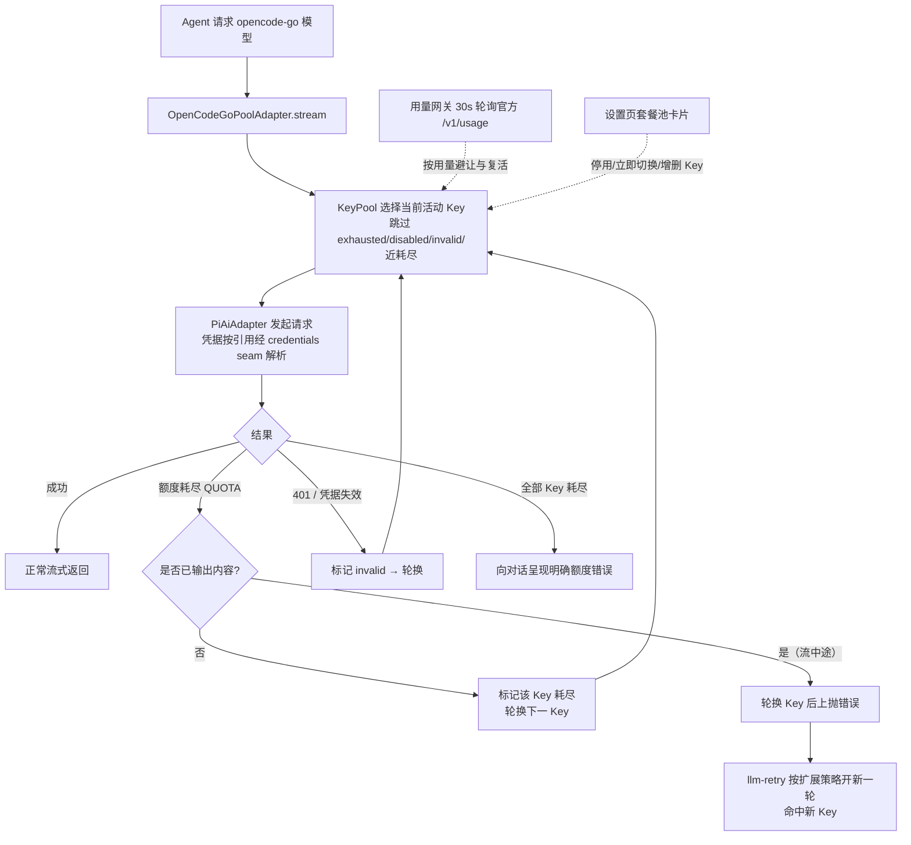

# dsh-opencode-go-pool

DeepSeek Harness（DSH）插件：**OpenCode Go 套餐的多 Key 池** —— 当前 Key 额度耗尽时**自动、无感地切换到下一个 Key**，并在设置页提供与官网一致的**套餐余额管理卡片**（5 小时滚动 / 每周 / 每月 已用·剩余·重置时间）。

- 每个 OpenCode Go 账号有独立的 5 小时滚动 + 每周 + 每月额度。DSH 官方供应商（`dsh-llm-pi-ai` 的 `opencode-go` 路由）每个供应商只能填一个 Key，额度耗尽后必须手动更换——本插件接管该路由，用 Key 池 + 自动故障切换解决。
- 余额数据来自 OpenCode 官方用量接口（与官网同源，见下文）。

## 功能

| 功能 | 说明 |
|---|---|
| 🔄 自动切换 Key | 请求因额度耗尽（`QUOTA`）失败时，在同一次流式调用内静默换下一个 Key 重发，对话零感知；凭据失效（401/`INVALID_CREDENTIAL`）同样自动跳过 |
| 📊 套餐管理卡片 | 设置侧边栏「OpenCode Go 套餐池」页：每个 Key 的 5h 滚动 / 每周 / 每月 已用%·剩余%·重置倒计时，与官网一致 |
| 🎛 运行态管理 | 卡片内：立即切换、停用/启用、清除失效、新增/删除 Key（写入插件命名空间，带版本栅栏，无需改 yml） |
| ♻️ 自动复活 | 额度耗尽的 Key 在其 5h 窗口重置后（用量接口报告恢复）自动回到池中 |
| 🧭 无缝接管 | 接管 `opencode-go` 路由：删除「设置 → 模型」中的 opencode-go 行后自动完成，历史会话与模型选择器完全不变 |
| 🗂 模型选择 | 卡片内勾选该路由暴露哪些模型：「全部模型」跟随官方目录；自定义时未勾选的模型不出现在聊天模型下拉、也无法发起请求；默认折叠，点「展开」查看 |
| 📥 拉取最新模型 | 卡片内「拉取模型」从官方 `models` 接口抓取供应商最新模型列表；目录里还没有的新模型即时进入可选列表（按默认协议接入，勾选即可尝试） |
| 🖼 识图（`visionModels`） | 官方目录未声明、但上游实际支持看图的模型（默认 `deepseek-v4.1-flash`、`deepseek-flash`）声明为支持图片输入：对话里可直接粘贴图片，图片随请求发给模型。见下文「识图」 |

## 安装（v0.1.13 起自动挂载，一条命令）

本包声明了 `dsh.bundle.patch`（包内 `cordis.patch.yml`）：`dsh plugin add` 安装后，
DSH 会自动把它追加进 profile 的 `dsh.profile.bundles` 层栈并随启动自动挂载——
**无需手写任何挂载行**。

```sh
dsh plugin --profile web add github:join123-bit/dsh-opencode-go-pool#<commit-sha>
```

之后：

1. 确认自动挂载生效：`cat "$DSH_HOME/profiles/web/package.json"` 中
   `dsh.profile.bundles` 应包含 `dsh-opencode-go-pool`；
2. **删除**（若有）`$DSH_HOME/profiles/web/cordis.patch.yml` 里手工写的
   `opencode-go-pool` 行——用户 patch 晚于 bundle 层、按行覆盖，重复写会以你
   的手工行为准，容易与升级后的默认配置偏离；
3. 重启 DSH（插件变更需重启生效）。随后：

1. **迁移**：打开「设置 → 模型」，删除 `opencode-go` 供应商行（本插件会自动接管该路由；未删除时插件保持休眠并在卡片中显示引导）。
2. **配置 Key**：打开「设置 → OpenCode Go 套餐池」→「Key 管理」，为每个账号添加一行（id 自动生成；label 为显示名；凭据引用填环境变量名，如 `OPENCODE_GO_KEY_A`）。
3. **填写密钥**：把每个 Key 的明文写入凭据页（设置 → 模型 → 凭据，对应环境变量名），或 `~/.dsh/.credentials.yaml` / 环境变量。**明文 Key 永不进入插件配置、日志或任何 RPC 响应。**

### 手工安装（等价步骤，仅当不用 `dsh plugin` 时）

`$DSH_HOME/profiles/web/cordis.patch.yml` 加入插件行：

```yaml
- id: opencode-go-pool
  name: 'dsh-opencode-go-pool'
  config:
    route: opencode-go          # 接管官方路由；冲突时休眠等待接管
    keys: []                    # 初始为空，由卡片管理（也可在此预置）
    preemptAtPercent: 100       # <100 时，5h 用量达到即主动避让（默认 100：失败才切）
    modelMode: all              # all=暴露全部官方模型；custom=仅暴露 models 列出的模型
    models: []                  # modelMode=custom 时的模型 id 列表（也可在卡片内勾选）
    headers:                    # 透传给上游的额外请求头；官方 opencode-go 路由如有请原样搬过来
      x-opencode-session: dsh-opencode-go-session
    usageBaseUrl: https://opencode.ai/zen/go/v1/usage
    usageRefreshMs: 30000
    timeoutMs: 15000
```

并在 profile 的 `package.json` 中声明依赖后重新安装依赖。

## 工作原理



- **静默切换发生在同一次 `stream()` 内**：额度错误在产出任何 token 前到达时，直接换 Key 重发，上层（agent loop）看到的是一次成功的流式回复。
- **流中途限额**（已吐 token 后 429）无法静默重试；此时先轮换 Key 再上抛，插件同时把 `QUOTA` 加入该路由的可重试码（预算 = Key 数），`dsh-llm-retry` 会自动开新一轮命中新 Key。
- **路由接管**：`opencode-go` 路由被 `dsh-llm-pi-ai` 持有时，插件休眠并监听 `llm/adapters-updated`，路由一释放即原子接管；老会话记录的路由 id 不变，历史对话无缝继续。
- **凭据**：配置只存凭据引用名（`apiKeyEnv`），明文走 DSH 凭据 seam，每次请求按引用解析；解析失败大声报 `MISSING_CREDENTIAL`，绝不回落到无关的环境变量 Key。
- **模型选择**：卡片勾选后写入 `modelMode`/`models`；适配器的 `listModels` 只返回勾选的模型（聊天模型下拉即时生效），`resolveModel`/`stream` 对未勾选模型返回明确的 `UNKNOWN_MODEL`。选择变化会重发 `llm/adapters-updated`，模型选择器无需重启即可刷新。
- **识图**：`visionModels` 列出的模型，其描述符 `input` 追加 `image`（`withVisionInput()`）；`listModels()` 上报的 `inputModalities` 因此包含 `image`，会话控制器的附件准入与适配器的图片内联随之放行。列表变化会重建 profile 并重发 `llm/adapters-updated`。
- **持久化**：运行态（活动 Key / 耗尽 / 失效 / 停用）原子写入 `$DSH_HOME/opencode-go-pool.state.json`，重启恢复。

## 用量接口

```http
GET https://opencode.ai/zen/go/v1/usage
Authorization: Bearer <OpenCode Go API Key>
```

返回三个窗口的 `percent`（0–100）与 `resetsAt`（ISO-8601）：

```json
{ "usage": { "rolling": {"status":"ok","percent":9, "resetsAt":"…"},
             "weekly":  {"status":"ok","percent":12,"resetsAt":"…"},
             "monthly": {"status":"ok","percent":6, "resetsAt":"…"} } }
```

该接口**未写入 OpenCode 公开文档**，解析做了防御式处理：形状变动只影响卡片显示（降级为错误提示），不影响自动切换功能；`usageBaseUrl` 可配置。

## 配置项

| 键 | 默认 | 含义 |
|---|---|---|
| `route` | `opencode-go` | 接管官方路由；改为 `opencode-go-pool` 时注册自有路由（与官方并存，模型选择器需手动切换一次） |
| `keys` | `[]` | Key 列表：`{id, label, apiKeyEnv}`；通常留空由卡片管理 |
| `preemptAtPercent` | `100` | 5h 滚动用量达到该百分比即主动避让；100 = 仅在失败时切换 |
| `modelMode` | `all` | `all`=暴露官方目录全部模型（新模型自动可用）；`custom`=仅暴露 `models` 勾选的模型 |
| `models` | `[]` | `modelMode=custom` 时的模型 id 列表；卡片内「模型选择」勾选后写入 |
| `visionModels` | `[deepseek-v4.1-flash, deepseek-flash]` | 声明为「支持图片输入」的模型 id 列表：这些模型的 pi-ai 描述符 `input` 会追加 `image`。官方目录自带模态的模型不必列在这里。见下文「识图」 |
| `headers` | `{}` | 透传给 OpenCode Go 上游的额外请求头；官方路由配置了 `x-opencode-session` 时务必原样搬入，否则可能丢失会话/缓存加速 |
| `usageBaseUrl` | `https://opencode.ai/zen/go/v1/usage` | 用量接口地址 |
| `modelsBaseUrl` | `https://opencode.ai/zen/go/v1/models` | 「拉取模型」接口地址 |
| `usageRefreshMs` | `30000` | 卡片轮询间隔（host 侧另有 15s TTL 缓存） |
| `timeoutMs` | `15000` | 用量请求超时 |

## 识图（`visionModels`）

DSH 判断一个模型能否看图，只看 pi-ai 描述符的 `input` 数组：它既是 `listModels()` 上报的
`inputModalities`（会话控制器据此准入附件，不含 `image` 时直接拒绝「Model does not support
image input」），也是适配器 `stream()` 内联图片前的最后一道检查。

问题在于：**从官方 `models` 接口拉取进来的模型（"动态"模型）没有模态信息**，插件给它们
合成的描述符一律是 `input: ['text']` —— `deepseek-v4.1-flash` 正好就是这种模型（pi-ai 自带
目录里没有它），所以即便上游支持看图，DSH 也会先把图片拦掉。

`visionModels` 就是那个开关：列在里面的模型 id，其描述符 `input` 追加 `image`。

```yaml
opencode-go-pool:
  visionModels:
    - deepseek-v4.1-flash
    - deepseek-flash
```

**默认值已包含 `deepseek-v4.1-flash` 与 `deepseek-flash`，开箱可用**，不改配置也有识图。
要再加模型，先按下面的方法实测，再加 id。

声明模态只是开关的一半：图片真正发给模型前，适配器会把 profile 上的图片请求策略
（`maxRequestImageBytes` / `requestImagePixelBudget` / `requestImageMaxBytes`）交给附件服务，
**附件服务会校验它们是正整数**。插件已按官方默认值补齐（20MiB / 4M px / 1MiB）；这三个值
缺失时报的是 `Image request maxPixels must be a positive integer.`（`INVALID_ATTACHMENT_REF`），
而不是「不支持图片」。

### 为什么名单必须实测后再加

给一个其实看不了图的模型声明 `image` 不会立刻报错，而是**静默失败**：图片被准入、写进会话
记录，模型却看不见它，照常编一个回答——这是最坏的失败方式。2026-09-23 对官方端点
（`POST https://opencode.ai/zen/go/v1/chat/completions`，需带 `x-opencode-session` 头）逐个
探测的结果：

| 模型 | 结果 |
|---|---|
| `deepseek-v4.1-flash` | ✅ 正确读出图里的文字与图形（默认已开） |
| `deepseek-flash` | ✅ 同上（默认已开） |
| `deepseek-v4-pro` | ⚠️ 接受 `image_url`，随后回答「I can't view the image」——静默忽略 |
| `deepseek-v4-flash`、`glm-5.3` | ❌ HTTP 400 `Model only supports text input` |
| `mimo-v2.5-pro` | ❌ 404，模型未在该路径提供服务 |

验证一个候选模型（把 `<id>` 换掉即可）：

```sh
curl -s https://opencode.ai/zen/go/v1/chat/completions \
  -H "Authorization: Bearer $OPENCODE_GO_KEY_KEY_MTS3LB30" \
  -H 'Content-Type: application/json' \
  -H 'x-opencode-session: dsh-opencode-go-session' \
  -d '{"model":"<id>","max_tokens":64,"messages":[{"role":"user","content":[
        {"type":"text","text":"Read the exact text in this image."},
        {"type":"image_url","image_url":{"url":"data:image/png;base64,<BASE64>"}}]}]}'
```

能准确读出图片里**特定**的文字/颜色 = 真识图；报 400 = 不支持；答「看不到图片」= 静默忽略。
只有第一类才写进 `visionModels`。

## 与其他插件的关系

- 本插件覆盖 [dsh-opencode-go-usage](https://github.com/xiaoqi20/dsh-opencode-go-usage) 的全部功能（多 Key 版），安装后可卸载后者。
- 与 `dsh-llm-pi-ai` 共存：接管模式下请删除其 `opencode-go` 行；pi-ai 的其他供应商不受影响。

## 开发

纯 ESM，零构建步骤：

- Host 半：`index.js`（插件 + 池适配器 + 接管）、`pool.js`（状态机）、`usage.js`（用量网关）、`models.js`（模型目录拉取）、`typert.host.js`（RPC 清单）
- 浏览器半：`client.js`（lazy-CJS bundle，`window.__ModuleLoader__.load` 格式）
- 测试：`node --test test/*.test.mjs`（本仓库随 v0.1.16 附 `test/vision.test.mjs`：识图声明的 6 项单元测试，纯 Node、无需 harness 依赖；上游其余测试文件未随本 fork 提供，缺少 harness 依赖时相关测试优雅跳过）

```sh
node --test test/*.test.mjs
```

## 注意事项

- **多账号使用请自行确认符合 OpenCode 服务条款**；本插件只提供技术能力。
- 全池耗尽时对话会收到明确的额度错误，卡片会全红显示；5h 窗口重置后自动恢复。
- 每 Key 每次静默重试会重复计费输入 token（额度失败本身不计费），成本上限 = 池大小 × 单请求。

## 稳定性：升级 DSH 后怎么办

DSH 目前只有 `0.1.x` 的 rc/alpha 发布，插件契约（`dsh-llm` / `dsh-settings` / `dsh-llm-pi-ai` 等）随时可能改名、删名或改形。本仓库 **v0.1.11 起**内置**集成点探针 + 休眠降级**：

- 启动时先探测所有依赖的 DSH 接口：模块导入、`opencodeGoProvider()` / `PiAiAdapter` 构造契约、`llm` / `settings` / `credentials` 服务方法；
- 探测失败 → 插件**休眠**：不接管路由、不抛错、官方单 Key 路由照常服务；原因写入日志，并显示在设置卡片的 `takeoverHint` 上；
- 这样 DSH 升级对插件的影响从"启动即崩 / 拖垮 host"降级为"可见的休眠状态"。
- **v0.1.15 起**探针之外再加一层 `smoke.mjs` 的 profile 契约校验：`buildProfile()` 手写的 profile
  字段（如 `modelErrors`）是被 `PiAiAdapter` 在**调用期**解引用的，启动探针看不见——漏字段时插件
  照常启动、供应商照常列出，只有模型选择器报“加载失败”。该守卫用真实适配器驱动一次
  `resolveModel()`，把这类漂移前移到冒烟阶段。
- **v0.1.17 起**：Typert 的 `create()` 契约（`dsh-typert-protocol >= 0.1.6`）**两条路径都要满足**：
  - **host 侧**（`typert.host.js`）：typert-loader 在插件 body 运行**之前**校验每个 strict codec，
    不满足直接"加载失败"而不是休眠，探针同样看不见 —— `smoke.mjs` 第 6 项守卫；
  - **客户端侧**（`client.js`）：设置卡片经 `ctx.remote.$mount()` 挂载远程，**客户端注册表**
    （`dsh-typert-registry` 的 `validateCodec`）同样要求 strict codec 带 `create()`，
    不满足表现为卡片「加载失败: typert: … result strict codec has no create() factory」
    —— v0.1.18 修复，`smoke.mjs` 第 7 项做源形状守卫。
  升级 DSH 后若插件或卡片加载失败，先对照这两个文件的 codec 形状。

### 升级 DSH 后的三步检查

1. **冒烟**（跑通过再信任插件）：

   ```sh
   cd "$DSH_HOME/profiles/web" && node node_modules/dsh-opencode-go-pool/smoke.mjs
   ```

   全部 `PASS` 再继续；`FAIL` 行就是被改动的接口名。
2. **重启 DSH**，打开「设置 → OpenCode Go 套餐池」：卡片正常显示 Key 状态/用量 = 插件接管正常。
3. **验证路由接管**：删除官方 `opencode-go` 行后发一条对话请求，确认走池（Key 轮换时卡片 `lastSwitch` 更新）。若卡片显示 `integration probe failed: …`，插件在休眠态——按 FAIL 内容看 DSH changelog 适配，或回滚 DSH 版本后重启，**不要原地反复重试启用**。

### 兼容矩阵

| DSH 版本 | 插件版本 | 模块探针 | 路由接管 | 设置卡片 | 备注 |
|---|---|---|---|---|---|
| 0.1.2-rc.1 | 0.1.10 / 0.1.11 | ✅（0.1.11 起） | ✅ Windows 实测 | ✅ Windows 实测 | `settingsNamespace` 补丁基线；macOS 待复测 |
| 0.1.5-rc.1 | 0.1.15 | ✅ | ✅ macOS 实测 | ✅ macOS 实测 | 模型选择器 `resolveModel()` 曾因 profile 缺 `modelErrors` 报“加载失败”；0.1.15 修复并加回归守卫 |
| 桌面 nightly（`dsh-typert-protocol ≥ 0.1.6`） | 0.1.18 | ✅ host loader + 客户端注册表契约校验（asar 内真实代码逐字对照） | 待桌面实测 | 待桌面实测 | 曾报「卡片加载失败」（客户端 codec 无 `create()`）；0.1.17 修 host 侧、0.1.18 修客户端侧并同步 peer 范围 |
| 0.1.3-alpha.* | 未适配 | ⚠️ 升级前先跑 `smoke.mjs` | — | — | 探针会把它打成休眠而非崩溃 |

每次 DSH 升级后更新此表：新版本号 → 跑 smoke → 适配 → 记录结果。

### 版本锁定（防止安装漂移）

git 依赖**必须锁 commit**，升级是显式动作、可回滚：

```sh
dsh plugin --profile web add github:join123-bit/dsh-opencode-go-pool#<commit-sha>
```

或 profile 的 `package.json`：

```json
"dependencies": {
  "dsh-opencode-go-pool": "github:join123-bit/dsh-opencode-go-pool#<commit-sha>"
}
```

不要用不带 sha 的 git 依赖——每次重装都会漂到该分支最新代码，你验证过的组合就失效了。

## 许可证

MIT

## 验证记录（无 GUI 真实启动）

除 38 项测试外，插件已在真实 DSH host 中完成无 GUI 启动验证（dsh CLI + 一次性测试 profile）：

```sh
DSH_HOME=/tmp/dsh-boot-test/home \
OPENCODE_GO_KEY_A=sk-test-placeholder-aaaa OPENCODE_GO_KEY_B=sk-test-placeholder-bbbb \
node $DSH_APP/node_modules/@deepseek-ai/dsh/lib/bin.js --profile test "ping"
```

预期输出（证明 agent 请求真实派发进池适配器并完成轮换）：

```
dsh: QUOTA: opencode-go-pool: every key is exhausted, disabled, or invalid …
```

状态文件同时记录：两个 Key 因真实 401（`AuthError: Invalid API key.`）被标记 `invalid`、依次轮换、`lastSwitch.reason: invalid`。真实凭据下额度耗尽（`QUOTA`）走完全相同的轮换机器。
